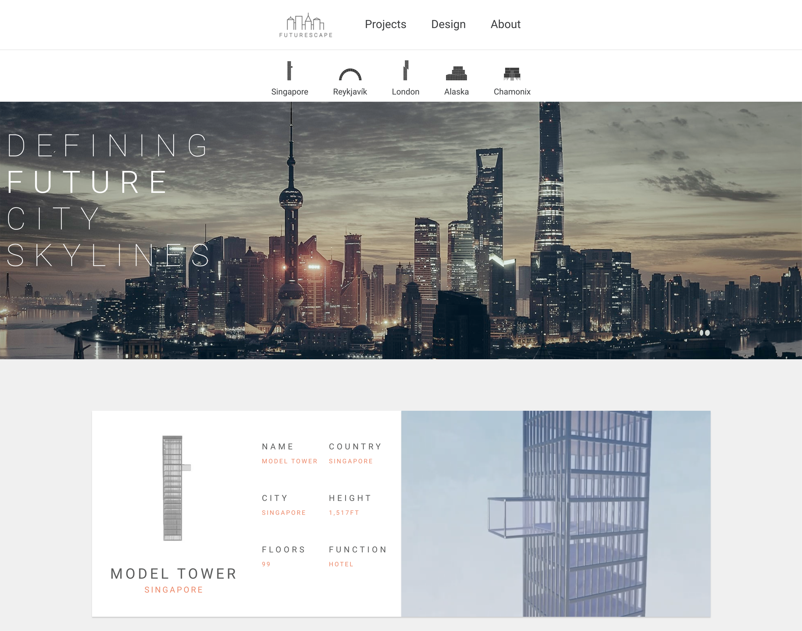

A single-page concept website for an architectural firm which showcases 3D designed assets. 

Live Demo: https://tmjcr.github.io/FutureScape/

-How I built this:
* This was a very simple application which I built as a means of learning how to use React. One of my hobbies is to design and build landscapes in 3D software such as Unreal Engine and Dreams on PS4 so this project gave me the opportunity to combine two of my greatest interests.
* As the project itself is quite straightforward there is a limited amount of state. The navigation bar acts as the controller for the user to view different projects and the data is populated in the relevant sections.
* Originally I had used Three.js to import 3d models themselves into the browser and while this did to some extent work, the textures of the models were not particularly detailed given the limitations of the browser, so I replaced them with mp4 files of buildings that were built in Dreams.  

-What I learnt:
* This was one of the first projects I built using React so my focus was learning the basics of state, props, hooks etc.
* I learned how to use Three.js to import and render 3d models, although this did not end up being present in the final application. 
* I designed the appearance for the application using AdobeXD and focused on some of the fundamental concepts of UX/UI design such as contrast, alignment, whitespace, and visual hierarchy.
* I experimented with a combination of CSS grid and flexbox to make the website responsive.

-What I would do differently if I were to do it again:

* I initially designed the website as a desktop website and then retro-fitted it to be mobile friendly, however this was not without its challenges so I would probably use a mobile-first approach for a straightforward application such as this.
* I would save the videos for the application on a CDN as currently they are downloaded directly from the server which could impede loading times on a particularly slow connection.
* The application is essentially made up of card components and although the content they display is different, it would probably be more efficient to conditionally populate the cards, as opposed to having a separate component for each type of card.
